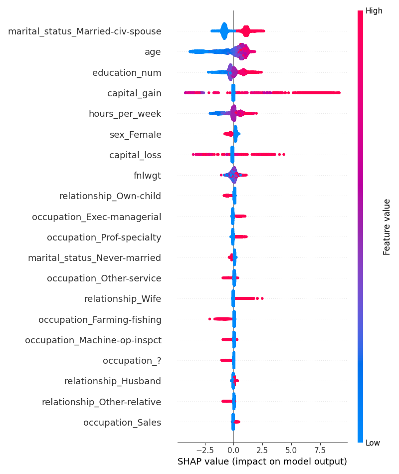
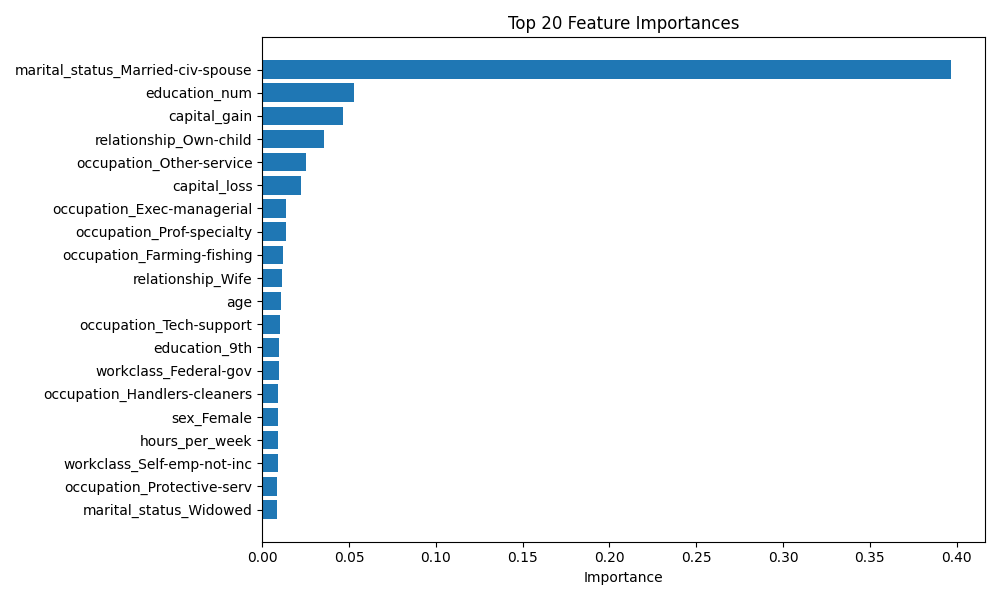
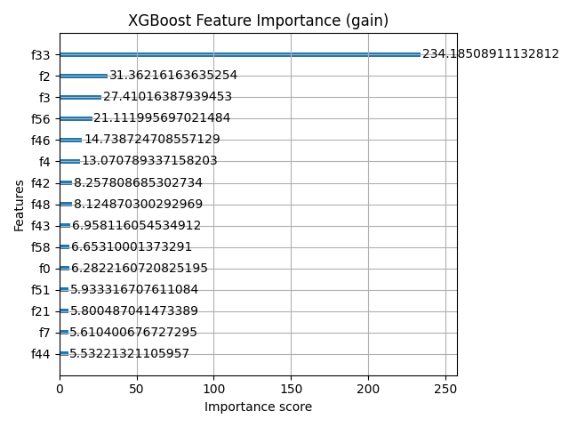
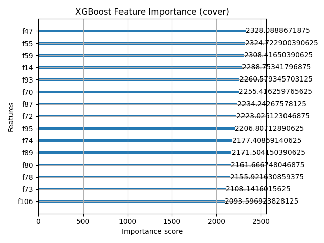
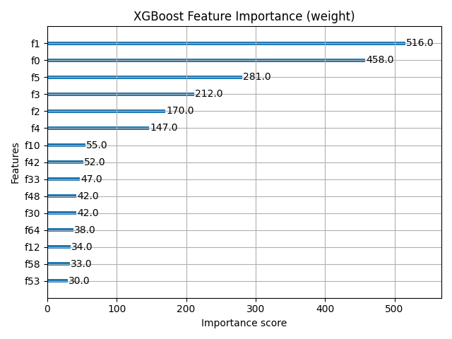

# Tabular AutoML Pipeline for Income Classification

This project implements a full machine learning pipeline to classify whether an individual's income exceeds \$50K per year based on the UCI Adult dataset. It includes preprocessing, model selection, hyperparameter tuning, evaluation, and model interpretation using feature importance and SHAP values.

---

## 📁 Project Structure

```
tabular_automl/
├── artifacts/                     # Saved preprocessing artifacts and datasets
│   ├── feature_names.pkl
│   ├── preprocessor.joblib
│   ├── X_train.pkl
│   ├── X_test.pkl
│   ├── y_train.pkl
│   ├── y_test.pkl
│   └── best_xgb_params.json       # (If tuning is done)
│
├── results/                       # Output from model evaluation and interpretation
│   ├── best_model.joblib
│   ├── ROC_curve.png
│   ├── confusion_matrix.png
│   ├── shap_summary_plot.png
│   ├── top_20_feature_importances.png
│   ├── xgb_feature_importance_cover.png
│   ├── xgb_feature_importance_gain.png
│   └── xgb_feature_importance_weight.png
│
├── data/
│   └── adults.csv                 # Raw dataset
│
├── src/
│   ├── model_selector.py         # Trains and selects best baseline model
│   └── tun_xgb.py                # Hyperparameter tuning with Optuna
│
├── main.py                       # Loads data, applies model, interprets results
└── preprocessing.py              # Preprocessing and feature engineering
```

---

## 🔄 Workflow Overview

1. **Preprocessing**

   * Handled missing values
   * One-hot encoded categorical features
   * Scaled numerical features
   * Saved: `X_train.pkl`, `X_test.pkl`, `y_train.pkl`, `y_test.pkl`, `preprocessor.joblib`, and `feature_names.pkl`

2. **Model Selection or Hyperparameter Tuning**

   * If `best_xgb_params.json` is present → Uses tuned `XGBClassifier`
   * If not → Runs model selection via `evaluate_models` to find best baseline model

3. **Model Evaluation**

   * Evaluated on test data using:

     * F1 Score
     * Precision
     * Recall
     * ROC AUC
     * Confusion matrix

4. **Model Interpretation** (only for XGBoost)

   * SHAP summary plot for global interpretability
   * Top 20 most important features bar chart
   * XGBoost feature importance visualized via gain, cover, and weight

---
## ✅ Test Metrics

### Baseline (default XGBoost)

```
F1 Score:   0.7055  
Precision:  0.7573  
Recall:     0.6605  
```

### Tuned XGBoost (Optuna)

```
F1 Score:   0.7107  
Precision:  0.7622  
Recall:     0.6658  
```

### Final (with feature‑importance and any further calibration)

```
F1 Score:   0.7214  
Precision:  0.7775  
Recall:     0.6728  
```

---

## 📊 Model Performance Comparison

| Model              | F1 Score   | Precision  | Recall     |
| ------------------ | ---------- | ---------- | ---------- |
| LogisticRegression | 0.6842     | 0.7505     | 0.6290     |
| RandomForest       | 0.7031     | 0.7520     | 0.6610     |
| XGBoost (default)  | 0.7055     | 0.7573     | 0.6605     |
| XGBoost (tuned)    | 0.7107     | 0.7622     | 0.6658     |
| **Final**          | **0.7214** | **0.7775** | **0.6728** |

---

## ✅ Final Model: Tuned XGBoost

### 📊 Test Metrics:

* **F1 Score**: 0.7214
* **Precision**: 0.7775
* **Recall**: 0.6728
* **ROC AUC**: 0.9218

---

## 📉 Visualizations

### ROC Curve


### Confusion Matrix


### SHAP Summary Plot



### Top 20 Feature Importances



### XGBoost Feature Importance

* **Gain**
  
* **Cover**
  
* **Weight**
  

---

## 🔍 Key Learnings

* Building a clean, reusable ML pipeline
* Baseline vs. tuned model comparisons
* End‑to‑end interpretability with feature importances & SHAP

## 📌 Notes

* Feature interpretation is only run if the selected model is XGBoost.
* All intermediate artifacts are cached in the `artifacts/` folder for reproducibility.

---

## 🚀 How to Run

```bash
# Preprocess the dataset
python preprocessing.py

# Train model and evaluate
python main.py
```

---

## 📚 Dataset

* Source: [UCI Machine Learning Repository - Adult Dataset](https://archive.ics.uci.edu/ml/datasets/adult)

---

## 📬 Contact

For any questions, feel free to reach out!
